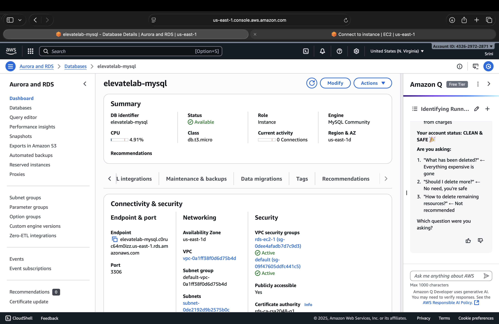

# ElevateLab — Task 5: Cloud Database (AWS RDS + EC2)

---

## Objective
To understand how **cloud-managed databases** work by creating an **AWS RDS MySQL instance**, connecting to it securely from an **EC2 instance**, and performing basic **SQL operations**.

---

## Tools Used
- **AWS RDS (Free Tier)** — Managed MySQL Database  
- **AWS EC2 (Free Tier)** — Linux instance for database connection  
- **MariaDB/MySQL Client** — To execute SQL queries  
- **AWS VPC & Security Groups** — For private networking and secure access  

---

## Step-by-Step Implementation

### Step 1: Create RDS Database Instance**
1. Go to **AWS Console → RDS → Create Database**.  
2. Choose:
   - Engine: **MySQL**
   - Template: **Free Tier**
   - DB name: `elevatelab-db`
   - Username: `admin`
   - Password: *(your chosen password)*
3. Enable **Public Access: No**  
4. Create a new **VPC Security Group** — `ElevateLab-RDS-SG`.

**Screenshot:**  




---

### Step 2: Create EC2 Instance**
1. Go to **AWS Console → EC2 → Launch Instance**.  
2. Choose **Amazon Linux 2023 (Free Tier)**.  
3. Set instance name: `ElevateLab-EC2`.  
4. Create or select **Security Group** — `ElevateLab-EC2-SG`.  
   - Inbound Rule: SSH (Port 22) → My IP  
5. Launch the instance.

**Screenshot:**  


---

### Step 3: Configure Security Groups**
| Security Group | Purpose | Inbound Rule | Source |
|----------------|----------|---------------|---------|
| ElevateLab-EC2-SG | For EC2 Instance | SSH (22) | My IP |
| ElevateLab-RDS-SG | For RDS Instance | MySQL/Aurora (3306) | ElevateLab-EC2-SG |

This allows only your EC2 instance to connect to RDS.

**Screenshot:**  


---

### Step 4: Connect EC2 → RDS**
1. SSH into EC2:  
   ```bash
   ssh -i "ElevateLab.pem" ec2-user@ec2-54-173-47-222.compute-1.amazonaws.com
   ```
2. Install MySQL Client:
   ```bash
   sudo dnf install mariadb105 -y
   ```
3. Connect to RDS:
   ```bash
   mysql -h elevatelab-mysql.c0ruc64m0izz.us-east-1.rds.amazonaws.com -u admin -p
   ```

---

### Step 5: Create Database and Table

```SQL
CREATE DATABASE intern_demo;
USE intern_demo;

CREATE TABLE students (
  id INT AUTO_INCREMENT PRIMARY KEY,
  name VARCHAR(50),
  domain VARCHAR(30),
  score INT
);
```

---

### Step 6: Insert and View Data

```SQL
INSERT INTO students (name, domain, score)
VALUES ('Aarav', 'Cloud', 95),
       ('Diya', 'DevOps', 89);

SELECT * FROM students;
```

----

### Output:


**Screenshot:**  


---

### Learning Outcomes

1. Understood Database-as-a-Service (DBaaS) with AWS RDS.
2. Learned to securely connect EC2 and RDS via VPC and SGs.
3. Practiced SQL operations in a cloud environment.
4. Gained experience in cloud networking and connectivity.
